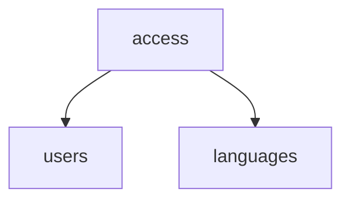

# Modules

## Access

### Dependencies

- `users` - Uses a user's system roles to determine whether they can perform certain actions.
- `languages` - Uses a user's language membership status to determine whether they can perform certain actions.
